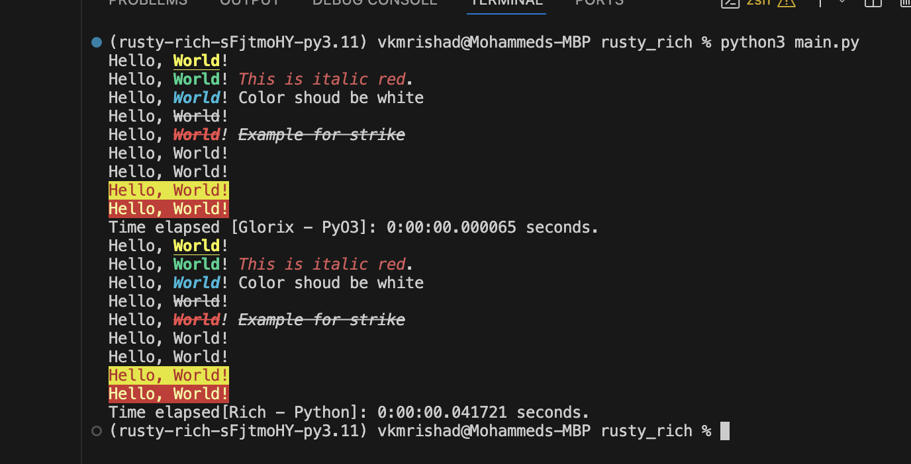

# glorix
Glorix is a Python library written in Rust for rich text and beautiful formatting in the terminal.

## Screehshots


## Building glorix for Python

1.  Clone this repo
2.  Install Python (3.10+)
3.  Create a virtual environment - `python3 -m venv env`
4.  Activate the environment - `. env/bin/activate`
5.  Update pip if needed - `pip install -U pip`
6.  Install maturin - `pip install -r requirements.txt`
7.  Build the crate and python wrapper - `maturin develop`

The last step will compile the Rust crate and create a Python wheel and
install <span class="title-ref">glorix</span> in the virtual
environment.

## Installing glorix from PyPi
1.  Install Python (3.10+)
2.  Create a virtual environment - `python3 -m venv env`
3.  Activate the environment - `. env/bin/activate`
4.  Update pip if needed - `pip install -U pip`
5.  Install glorix - `pip install glorix`

The last step will compile the Rust crate and create a Python wheel and
install <span class="title-ref">glorix</span> in the virtual
environment.

## Usage
```python
from glorix import print as lprint

lprint("Hello, [bold][underline yellow]World[/underline yellow][/bold]!")
lprint("Hello, [bold green]World[/bold green]! [italic red]This is italic red[/italic red].")
lprint("Hello, [i][b cyan]World[/b cyan][/i]! Color shoud be white")
lprint("Hello, [strike]World[/strike]!")
lprint("Hello, [i][b red][strike]World[/strike][/b red][i]! [s]Example for strike[/s]")
```
